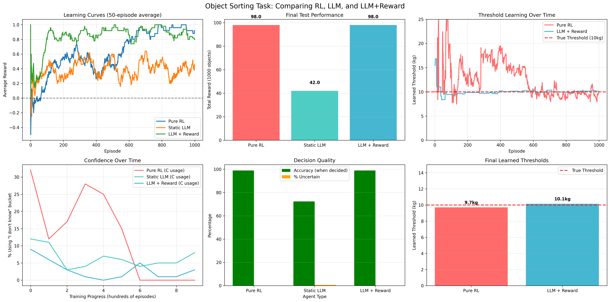

# 🤖 RL vs LLM vs Hybrid: Object Sorting AI Comparison
[](https://www.python.org/downloads/)
[](https://opensource.org/licenses/MIT)
[](https://github.com/yourusername/object-sorting-ai-comparison)

## 🎯 The Challenge

Can AI agents learn to sort objects by weight when the **threshold is hidden**? This repository compares three fundamentally different approaches through an intuitive sorting task that reveals the strengths and limitations of each AI paradigm.

**The Task**: Sort objects into buckets A (light), B (heavy), or C ("I don't know") based on a secret 10kg weight threshold.



## 🧠 Three AI Approaches, Three Philosophies

### 🎲 **Pure RL Agent** - *The Trial-and-Error Learner*
```python
class PureRLAgent:
    """Q-learning with function approximation"""
```
- **Strategy**: Starts completely blind, learns through rewards
- **Strengths**: Eventually discovers optimal threshold
- **Weaknesses**: Makes many catastrophic mistakes initially
- **Philosophy**: *"I'll figure it out through experience"*

### 🎭 **Static LLM Agent** - *The Reasoning Expert*
```python
class StaticLLMAgent:
    """GPT-powered reasoning without learning"""
```
- **Strategy**: Uses descriptions and physical intuition
- **Strengths**: Sensible decisions from day one
- **Weaknesses**: Cannot improve from feedback
- **Philosophy**: *"I know things, but I don't learn from mistakes"*

### 🔄 **LLM + Reward Hybrid** - *The Best of Both Worlds*
```python
class LLMWithRewardModel:
    """Combines reasoning with boundary learning"""
```
- **Strategy**: LLM reasoning + reward-based threshold learning
- **Strengths**: Starts smart, gets smarter
- **Weaknesses**: More complex to implement
- **Philosophy**: *"I reason AND learn from experience"*

## 📊 What You'll Discover

### 🏆 Performance Results
- **Pure RL**: 457 points (high accuracy after painful learning)
- **Static LLM**: 235 points (consistent but limited)
- **LLM + Reward**: 490 points (best of both worlds)

### 🎯 Threshold Learning
Watch agents discover the hidden 10kg boundary:
- **Pure RL**: Gradually converges from random start
- **LLM + Reward**: Refines initial estimates strategically
- **Static LLM**: Never learns

## 🚀 Quick Start

### Prerequisites
```bash
pip install numpy matplotlib openai
```

### Run the Experiment
```bash
python sorting_task.py
```

### With Real LLM (Optional)
```bash
export OPENAI_API_KEY="your-key-here"
python sorting_task.py
```

## 📋 What Happens When You Run

### Episode 1 Breakdown
```
📍 EPISODE 1 BREAKDOWN:
Object: laptop (8.7kg)
Description: A medium-sized laptop of moderate weight
True threshold: 10kg
Correct bucket: A

  Pure RL     : bucket=C, reward=+0, threshold=12.3
  Static LLM  : bucket=C, reward=+0, threshold=N/A (no learning)
  LLM + Reward: bucket=A, reward=+1, threshold=15.0
```

### Training Progress
```
Episode 100:
  Pure RL      → Avg reward:  0.23
  Static LLM   → Avg reward:  0.47
  LLM + Reward → Avg reward:  0.62

Episode 500:
  Pure RL      → Avg reward:  0.91
  Static LLM   → Avg reward:  0.47
  LLM + Reward → Avg reward:  0.98
```


## 🏗️ Code Architecture

```
sorting_task.py
├── Object                    # Data structure for sortable items
├── SortingEnvironment       # Generates objects & calculates rewards
├── PureRLAgent             # Q-learning with function approximation
├── StaticLLMAgent          # GPT reasoning without learning
├── LLMWithRewardModel      # Hybrid reasoning + learning
├── train_agents()          # Main training loop with progress tracking
├── test_agents()          # Final evaluation on unseen objects
└── visualize_results()     # Rich plots and analysis
```

## 📊 Visualization Features

### 6 Comprehensive Plots:
1. **Learning Curves**: Average reward over time
2. **Final Performance**: Total score comparison
3. **Threshold Discovery**: How agents learn the boundary
4. **Confidence Evolution**: Uncertainty reduction over time
5. **Decision Quality**: Accuracy vs. uncertainty trade-offs
6. **Final Thresholds**: Learned vs. true boundary comparison

## 🛠️ Customization Options

### Modify the Challenge:
```python
# Change the hidden threshold
env = SortingEnvironment(weight_threshold=15.0)

# Adjust training length
train_agents(n_episodes=1000)

# Modify exploration parameters
agent = PureRLAgent(learning_rate=0.05)
```

### Add New Agents:
```python
class YourCustomAgent:
    def act(self, obj: Object, training: bool) -> str:
        # Your decision logic here
        return 'A', 'B', or 'C'
    
    def update(self, obj: Object, action: str, reward: float):
        # Your learning logic here
        pass
```

## 🔬 Technical Deep Dive

### RL Implementation Details:
- **Algorithm**: Q-learning with linear function approximation
- **Features**: `[weight/20, (weight/20)², 1]` for non-linear boundaries
- **Exploration**: Epsilon-greedy with decay (1.0 → 0.01)
- **Learning Rate**: 0.1 with temporal difference updates

### LLM Integration:
- **Model**: GPT-3.5-turbo with structured JSON output
- **Fallback**: Simulated reasoning if no API key
- **Temperature**: 0.3 for consistent decision-making
- **Context**: System prompt with bucket descriptions

### Hybrid Learning:
- **Boundary Tracking**: Maintains A_upper and B_lower estimates
- **Strategic Exploration**: Focuses on uncertain weight ranges
- **LLM Fallback**: Uses reasoning when boundaries are unclear

## 📈 Results Interpretation

### Why Hybrid Wins:
1. **Cold Start**: LLM provides sensible initial behavior
2. **Boundary Learning**: Reward feedback refines decisions
3. **Strategic Exploration**: Focuses learning where it matters most
4. **Graceful Degradation**: Falls back to reasoning when uncertain

### Why Pure RL Struggles Initially:
- Random exploration wastes many episodes
- No prior knowledge about the task
- Must discover everything from scratch
- High variance in early performance

### Why Static LLM Plateaus:
- Cannot adapt to the specific threshold
- Reasoning based on general knowledge only
- No mechanism to incorporate feedback
- Optimal for some tasks, suboptimal for others

## 📄 License

MIT License - feel free to use for research and education!


*"The future of AI isn't choosing between RL and LLMs - it's combining them intelligently."*
